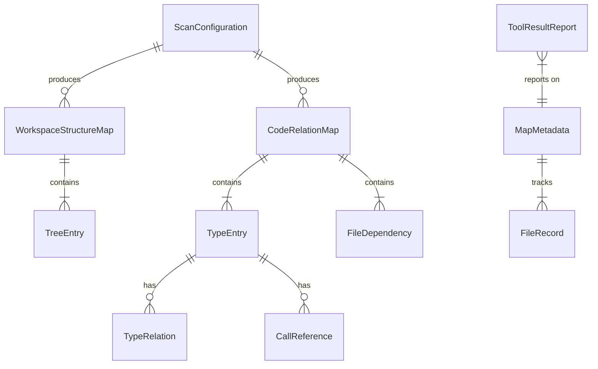

# Data Model: Workspace Mapping Tools (MCP Server)

**Feature**: 001-workspace-map-mcp | **Date**: 2026-07-07
**Source**: Key Entities in [spec.md](./spec.md) + decisions in [research.md](./research.md)

## Entity Overview



## 1. ScanConfiguration

Input settings for any scan/update invocation. Defaults applied when unspecified.

| Field | Type | Required | Default | Validation |
|---|---|---|---|---|
| `workspaceRoot` | string (abs path) | yes (server launch) | — | Must exist, be a directory, be readable; else clear error, no partial output (US1-AS4) |
| `includePatterns` | string[] (globs) | no | `[]` | Valid glob syntax |
| `excludePatterns` | string[] (globs) | no | `[]` | Valid glob syntax; layered on top of built-in defaults + .gitignore |
| `maxDocLines` | number | no | `1500` | > 100; partition threshold (FR-015) |

**Invariant**: built-in default exclusions (`.git`, `node_modules`, `bin`, `obj`, `dist`, `build`, `out`, `.vs`, `.idea`, `__pycache__`, `.venv`, `venv`, `target`, `packages`, `.codemap`) are always active and cannot be un-excluded by include patterns.

## 2. WorkspaceStructureMap (`.codemap/structure.md` + partitions)

The rendered markdown artifact. Logical model behind it:

| Field | Type | Notes |
|---|---|---|
| `generatedAt` | ISO-8601 string | FR-008 |
| `workspaceName` | string | Root folder name |
| `exclusionRules` | string[] | All applied rules, per layer (FR-002) |
| `folderCount` / `fileCount` | number | Summary counts (FR-008) |
| `root` | TreeEntry | Hierarchy root |
| `partitions` | string[] | Relative paths of partition docs when split (FR-015) |

### TreeEntry

| Field | Type | Notes |
|---|---|---|
| `name` | string | File/folder name |
| `relativePath` | string | Workspace-relative, `/`-separated (FR-001, FR-004) |
| `kind` | `folder` \| `file` \| `symlink` | Symlinks recorded once, not descended (edge case) |
| `children` | TreeEntry[] | Folders only; alphabetical, folders before files (deterministic) |

**State**: regenerated wholesale on every scan; never mutated in place (FR-014 atomic write).

## 3. CodeRelationMap (`.codemap/relations.md` + partitions)

| Field | Type | Notes |
|---|---|---|
| `generatedAt` | ISO-8601 string | FR-008 |
| `languageSummary` | `{ language, fileCount, tier }[]` | tier = `deep` \| `fallback` (FR-003, FR-011) |
| `typeCount` / `relationCount` | number | Summary counts |
| `types` | TypeEntry[] | Sorted by qualified name |
| `fileDependencies` | FileDependency[] | Import/using edges |
| `reducedAnalysisFiles` | `{ relativePath, reason }[]` | Unparseable or fallback-tier files (FR-011, US2-AS4) |

### TypeEntry

| Field | Type | Notes |
|---|---|---|
| `id` | string | `<language>:<qualifier>.<TypeName>@<relativePath>` — unique (FR-013) |
| `name` | string | Simple name |
| `qualifier` | string | Namespace / module path; disambiguates collisions (US2-AS5) |
| `kind` | `class` \| `interface` \| `struct` \| `enum` \| `trait` \| `type` \| `function-module` | Per-language mapping |
| `language` | string | Detected language |
| `definingFile` | string | Workspace-relative path (FR-004) |
| `relations` | TypeRelation[] | Inheritance / implementation |
| `calls` | CallReference[] | Best-effort (FR-003d) |

### TypeRelation

| Field | Type | Notes |
|---|---|---|
| `kind` | `inherits` \| `implements` | |
| `targetName` | string | As written in source |
| `targetId` | string \| null | Resolved TypeEntry id when target found in workspace; null for external types |

### FileDependency

| Field | Type | Notes |
|---|---|---|
| `fromFile` | string | Workspace-relative |
| `toFile` | string \| null | Resolved workspace-relative path; null when external (package import) |
| `rawSpecifier` | string | The import/using text as written |

### CallReference

| Field | Type | Notes |
|---|---|---|
| `methodName` | string | Called symbol name |
| `targetTypeName` | string \| null | Receiver/type when syntactically evident |
| `confidence` | `syntactic` | Always syntactic in v1 (documented best-effort) |

## 4. MapMetadata (`.codemap/meta.json`)

Machine-readable sidecar enabling incremental updates (R8). Not part of the human/AI-facing markdown contract.

| Field | Type | Notes |
|---|---|---|
| `version` | number | Sidecar schema version; mismatch → full regeneration |
| `generatedAt` | ISO-8601 string | Last successful run |
| `workspaceRoot` | string | Sanity check on reuse |
| `config` | ScanConfiguration snapshot | Config drift → full regeneration |
| `files` | FileRecord[] | One per included file |

### FileRecord

| Field | Type | Notes |
|---|---|---|
| `relativePath` | string | Key |
| `size` | number | Fast pre-filter |
| `mtimeMs` | number | Fast pre-filter |
| `contentHash` | string | Definitive change check |
| `language` | string \| null | Detected language |
| `typeIds` | string[] | TypeEntry ids defined in this file — enables stale-entry removal on delete/rename (US3-AS2) |

**State transitions**:

```text
(no meta.json) ──update_maps──▶ FULL GENERATION ──▶ meta.json v1 written
(meta.json valid) ──update_maps──▶ diff: added/changed → re-parse; removed → drop typeIds → INCREMENTAL RENDER
(meta.json corrupt / version or config mismatch) ──▶ FULL GENERATION (FR-005 fallback)
(interrupted run) ──▶ previous maps + meta.json intact (temp+rename, FR-014)
```

## 5. ToolResultReport

Returned by every tool invocation (FR-012). Uniform shape:

| Field | Type | Notes |
|---|---|---|
| `tool` | string | Tool name |
| `status` | `success` \| `partial` \| `error` | `partial` = completed with warnings (e.g., unparseable files) |
| `filesWritten` | string[] | Workspace-relative paths |
| `counts` | object | Tool-specific: folders/files, types/relations, added/changed/removed, sectionsUpdated |
| `durationMs` | number | |
| `warnings` | string[] | e.g., reduced-analysis files, queued-behind-mutex notice |
| `errors` | string[] | Empty on success |

## 6. AgentGuidance

Artifacts installed by `install_guidance` (FR-009/FR-010):

| Artifact | Path | Managed how |
|---|---|---|
| Agent skill | `.github/skills/workspace-map/SKILL.md` | Overwritten wholesale on re-run |
| Copilot guidance section | `.github/copilot-instructions.md` | Marker-delimited block `<!-- BEGIN workspace-map-mcp -->` … `<!-- END workspace-map-mcp -->`; create file if absent, replace block if markers present, append block otherwise; all other content preserved byte-for-byte (US4-AS1/2/4) |

**Validation rules**: guidance install must never delete or reorder user content outside markers; duplicate marker pairs → error with instruction to fix manually (never guess).
