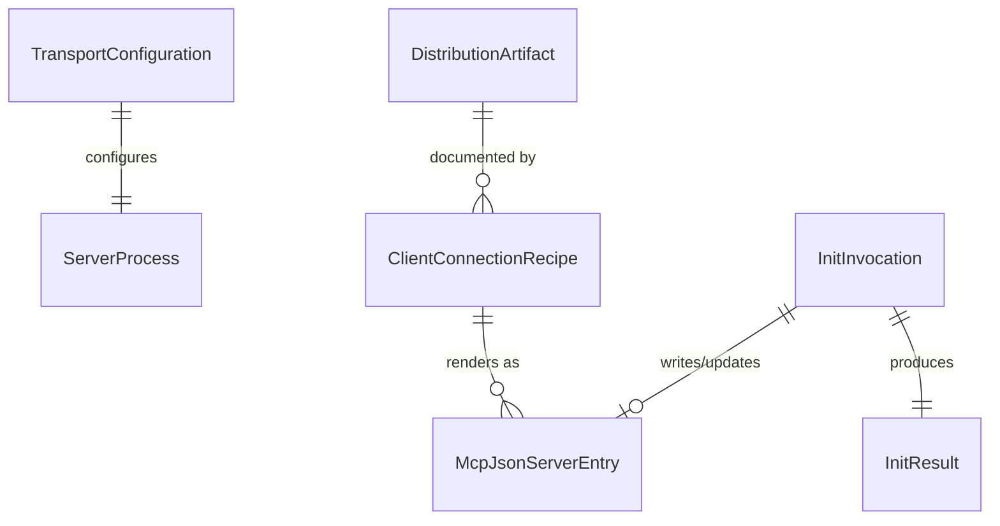

# Data Model: Hostable MCP Server Distribution & Multi-Project Connection

**Feature**: 002-hostable-mcp-distribution | **Date**: 2026-07-07
**Source**: Key Entities in [spec.md](./spec.md) + decisions in [research.md](./research.md)

## Entity Overview



## 1. TransportConfiguration

Launch-time settings parsed by `src/cli/args.ts` (R3/R4).

| Field | Type | Required | Default | Validation |
|---|---|---|---|---|
| `workspaceRoot` | string (abs path) | yes | — | Exists, directory, readable — unchanged error text (FR-006/FR-008) |
| `transport` | `stdio` \| `http` | no | `stdio` | `http` only when `--http` present |
| `port` | number | when `--http` | — | Integer 1–65535; missing with `--http` → actionable error; bind failure (EADDRINUSE) → clear error, exit non-zero (US2-AS3) |
| `host` | string | no | `127.0.0.1` | Any value other than `127.0.0.1`/`localhost` requires the flag to be explicitly present (FR-007 opt-in) |
| `maxDocLines` | number | no | 1500 | Unchanged from feature 001 |

**Invariants**: stdio path ignores port/host entirely; `--version` short-circuits before validation (FR-015).

## 2. DistributionArtifact

One per channel (conceptual — realized in package.json, Dockerfile, workflows).

| Channel | Artifact | Build-on-install | Key attributes |
|---|---|---|---|
| npm registry | Tarball `@anhnguyendaenet/workspace-map-mcp` | No — prebuilt via `prepublishOnly` (FR-001) | files: dist/, assets/grammars/, README; publishConfig access public |
| GitHub install | Git tree, self-building | Yes — guarded `prepare` (FR-002, R2) | devDeps available during git install; build-if-needed skip logic |
| Global/local | Same tarball or clone via `npm install -g` / `npm link` | Inherited from source | bin `workspace-map-mcp` on PATH (FR-003) |
| Docker | Image `ghcr.io/anhnguyendaenet/workspace-map-mcp:{version,latest}` | No — CI prebuilds context (R7) | node:20-slim, non-root, ENTRYPOINT server (FR-010) |

**Validation**: pack-smoke test asserts tarball completeness; Docker smoke asserts image runs stdio flow (R10).

## 3. ClientConnectionRecipe

Documented (docs/) or generated (init) connection instructions.

| Field | Type | Notes |
|---|---|---|
| `channel` | `npx` \| `global` \| `github` \| `docker-stdio` \| `docker-http` \| `http-url` | |
| `transport` | `stdio` \| `http` | |
| `clientFile` | string | `.vscode/mcp.json` (v1 generated target); Claude Desktop covered docs-only |
| `snippet` | McpJsonServerEntry or URL | Copy-paste ready, placeholders only for paths (US4-AS4) |

## 4. McpJsonServerEntry

The generated/merged entry inside `.vscode/mcp.json` → `servers["workspace-map"]`.

| Variant | Shape |
|---|---|
| npx stdio | `{ "command": "npx", "args": ["@anhnguyendaenet/workspace-map-mcp", "--workspace", "${workspaceFolder}"] }` |
| global stdio | `{ "command": "workspace-map-mcp", "args": ["--workspace", "${workspaceFolder}"] }` |
| docker stdio | `{ "command": "docker", "args": ["run","-i","--rm","-v","${workspaceFolder}:/workspace","ghcr.io/anhnguyendaenet/workspace-map-mcp","--workspace","/workspace"] }` |
| http | `{ "url": "http://127.0.0.1:<port>/mcp" }` |

**Merge rules (FR-012, R5)**: strict JSON parse or abort untouched; only `servers["workspace-map"]` is owned; all sibling servers/keys preserved; re-run replaces owned entry only (never duplicates); write is atomic.

**State transitions**:

```text
(no mcp.json) ──init──▶ file created with servers.workspace-map     [fileAction=created]
(valid json, no entry) ──init──▶ entry added, rest byte-preserved   [entryAction=added]
(valid json, entry present) ──init──▶ entry replaced in place       [entryAction=updated]
(invalid json / JSONC) ──init──▶ abort, actionable error, no write  [error]
```

## 5. InitResult

Printed by the init subcommand (structured, human-readable).

| Field | Type | Notes |
|---|---|---|
| `targetDir` | string | Resolved target project |
| `configFile` | string | Path written |
| `fileAction` | `created` \| `updated` | |
| `entryAction` | `added` \| `updated` | |
| `transport` | `stdio` \| `http` | |
| `channel` | string | Chosen launch channel |
| `guidanceInstalled` | boolean | FR-013 opt-in result (reuses feature-001 ToolResultReport internally) |
| `nextSteps` | string[] | e.g., reload client, run scan_structure |

## 6. VersionInfo (FR-015)

| Field | Type | Notes |
|---|---|---|
| `version` | string | Read from package.json at runtime; printed by `--version`/`-v`; identical value across all channels for a given release |
